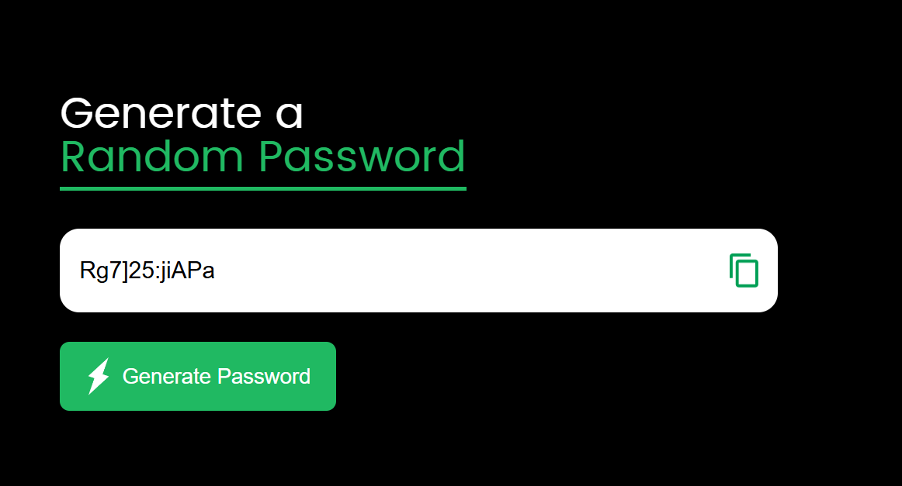

## Overview

The **Simple Password Generator** is a web application that generates random passwords based on user-defined criteria. This project was created to enhance my knowledge and skills in **HTML**, **CSS**, and **JavaScript**. 



## Features

- Generates secure, random passwords
- Customizable password length
- Option to include uppercase letters, lowercase letters, numbers, and special characters
- User-friendly interface

## Technologies Used

- **HTML**: For structuring the web page.
- **CSS**: For styling the application and ensuring a responsive design.
- **JavaScript**: For implementing the password generation logic and interactivity.

## Live Demo

You can try out the password generator [here](https://toqaezzatly.github.io/password_generator/).

## Installation

To run the project locally:

1. Clone the repository:
   ```bash
   git clone https://github.com/yourusername/password_generator.git
   ```

2. Navigate to the project directory:
   ```bash
   cd password_generator
   ```

3. Open `index.html` in your web browser.

## Usage

1. Open the application in your web browser.

2. Click the "Generate Password" button to create a new password.

## Goals

The main goal of this project is to enhance my understanding of web development technologies (HTML, CSS, JavaScript) while creating a practical and useful tool.
